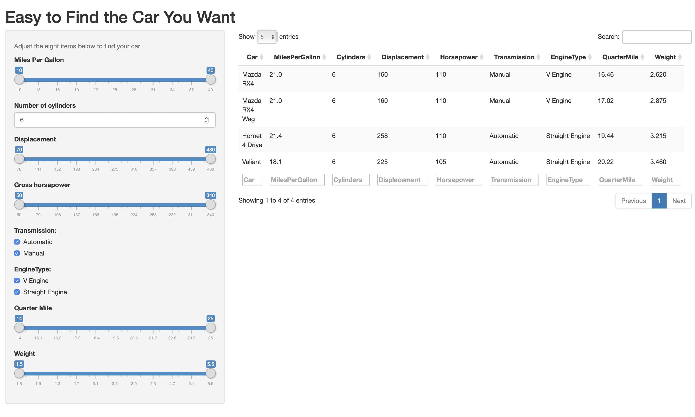

Easy to Find the Car You Want
========================================================
author: Sangdon, Choi
date: 2018-10-30
autosize: true

Agenda
========================================================

- Introduce
- Based Data
- How to use it?
- Summary

Introduction
========================================================

This application helps you find your desired car easily. 




Based Data
========================================================

The data in this application used the 'mtcars' contained in the R studio.


```
                   mpg cyl disp  hp drat    wt  qsec vs am gear carb
Mazda RX4         21.0   6  160 110 3.90 2.620 16.46  0  1    4    4
Mazda RX4 Wag     21.0   6  160 110 3.90 2.875 17.02  0  1    4    4
Datsun 710        22.8   4  108  93 3.85 2.320 18.61  1  1    4    1
Hornet 4 Drive    21.4   6  258 110 3.08 3.215 19.44  1  0    3    1
Hornet Sportabout 18.7   8  360 175 3.15 3.440 17.02  0  0    3    2
```


How to use it?
========================================================

We offer eight options to find the car you want.
You just need to adjust for each options.

There are eight options:

- Miles Per Gallon
- Number of users
- Displacement
- Gros Horspower
- Transmission
- EngineType
- Quarter Mile
- Weight


Summary
========================================================

Easy to Find the Car You Want could be Access by this link: https://nodgnas.shinyapps.io/server/

All source code this project : https://github.com/NoDgnaS/Coursera-course9


